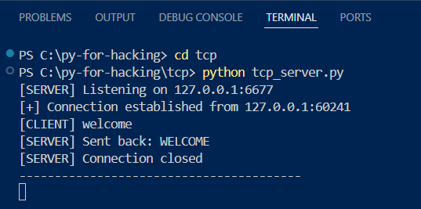
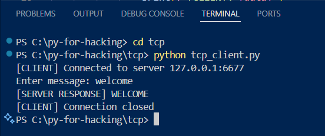
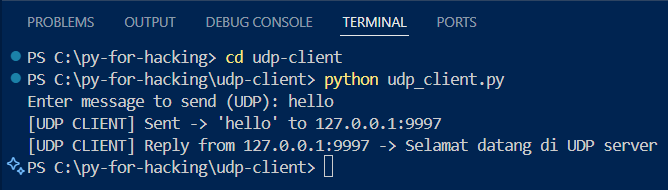
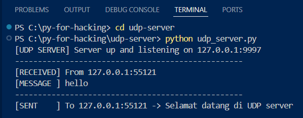

# Python-for-Hacking — PRAKTEK KONSEP JARINGAN (TCP & UDP)

* ## NAME : JULI AYU AUDIA
* ## NRP : 3124521016
---

## Folders structure

```
Python-for-Hacking/
├─ tcp/
│  ├─ tcp_server.py
│  ├─ tcp_client.py
├─ udp-server/
│  ├─ udp_server.py
├─ udp-client/
│  ├─ udp_client_simple.py
│  ├─ udp_client_interactive.py
├─ screenshots/          
└─ README.md   
```

---

## About

Simple educational examples of socket programming in Python to teach basic networking concepts:

* **TCP** (connection-oriented): `tcp_server.py` / `tcp_client.py` — server receives a message and replies with the uppercase version.
* **UDP** (connectionless): `udp_server.py` / `udp_client_*.py` — server listens for datagrams where client sends a datagram and receives a response.

Purpose: learn socket basics (`socket.socket`, `bind`, `listen`, `connect`, `send`, `recv`, `sendto`, `recvfrom`) and how to test locally using loopback `127.0.0.1`.

---

## Learning sources
* TCP: https://youtu.be/GlVfVn17_ug?si=KDHRpRAikI445ey2
* UDP SERVER: https://youtu.be/i1AOd7AQcok?si=mJ859eniuPcbnWoG
* UDP CLIENT: https://youtu.be/bKfDS1lOSho?si=SH-mh0x65_jg-bur

---

## Requirements

* Python 3.8+ (should work on Windows, macOS, Linux)
* No external libraries required

---

## How to run

### TCP

1. Open terminal A — start server:

```powershell
cd C:\py-for-hacking\tcp
python tcp_server.py
```

2. Open terminal B — start client:

```powershell
cd C:\py-for-hacking\tcp
python tcp_client.py
```

### UDP

1. Open terminal A — start UDP server:

```powershell
cd C:\py-for-hacking\udp-server
python udp_server.py
```

2. Open terminal B — run UDP client:

```powershell
cd C:\py-for-hacking\udp-client
python udp_client_interactive.py
```


---

## Expected outputs 

**TCP server:**




**TCP client:**




**UDP client:**




**UDP server:**



---

## Troubleshooting

* If `python` not found, try `python3` or ensure Python is in PATH.
* If `Address already in use`, change the port number in both client and server files.
* Run server first, then client.
* Use `127.0.0.1` for local testing. For multi-machine testing, use the host IP and allow firewall access.
* If the client times out, confirm the server is running and using the same IP/port.

---


## License

MIT License — feel free to reuse for learning purposes.
